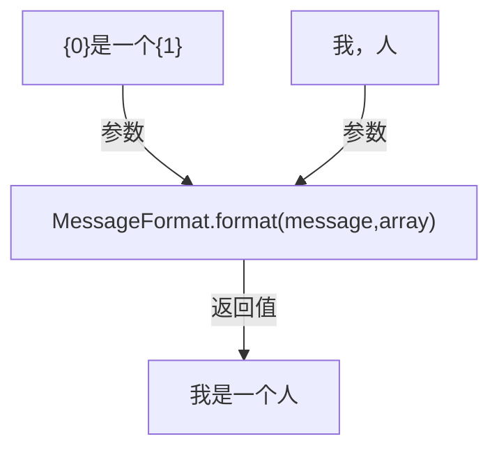

# 字符串格式化类



## MessageFormat类

- 支持多个参数-值对位复制文本
- 支持变量的自定义格式
- 例如将"Hello {1}"格式化为"Hello World"

## MessageFormat.format()方法

```java
        String message = "{0}{1}{2}";
        Object [] array = new Object[] {'a',2,'C'};
        String value = MessageFormat.format(message, array);
        System.out.println(value);

        //输出：a2C
```

- {0}中也可自定义格式

```java
        message = "{0,number,#.##} is a good number";
        array = new Object[] { new Double("3.1415") };
        value = MessageFormat.format(message, array);
        System.out.println(value);

        //输出：3.14 is a good number
```
