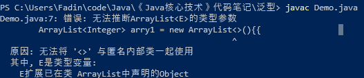
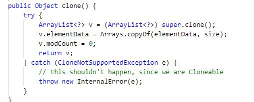
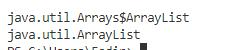
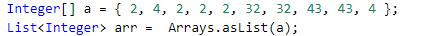

# Java问题汇总

## 2019年10月2日

1. 使用双括号运算符初始化List时，不可省略类型参数

``` java
 ArrayList<Integer> arry1 = new ArrayList<>(){{	// 会报错，因为无法推断出类型参数
            add(1);
            add(2);
        }};
```



2. 使用ArrayList的clone()方法时，必须要进行强制类型转换

``` java
 ArrayList<Integer> arry2 = (ArrayList<Integer>)arry1.clone();
```

- 因为ArrayList的cloen()方法返回值时Object类型，其他容器类型也是。



3. Arrays.asList()方法返回值是java.util.Arrays$ArrayList



- java.util.Arrays$ArrayList是Arrays的inner class
- 与java.util.ArrayList不是同一个东西
- 但它是List的子类，因此必须这样赋值


