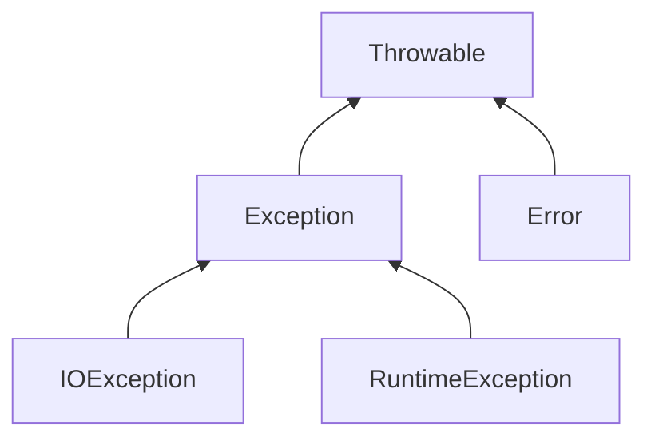

# 异常

## 异常分类

---

- Throwable：所有错误的祖先
- Error：（系统相关）系统内部或者资源耗尽。无需程序处理，不管。
- Exception：（程序相关）程序有关的异常。重点关注
  - RuntimeException：程序自身的错误
    - 5/0，空指针，数组越界……
  - 非RuntimeException：外界相关的错误
    - 打开一个不存在的文件
    - 加载一个不存在的类……
  
---

- Check Exception：(*非RuntimeException的Exception子类*)编译器会辅助检查。程序员必须处理，已发生后处理为主。
- Uchecked Exception：(*包括Error子类和RuntimeException子类*)。Runtime Exception，编译器不会辅助检查，程序必须处理，以预防为主。Error的子类，可以不用处理。
- **注意**：编译器会检查程序是否为check exception配置了处理。如果没有处理，会报错。

---

## 异常处理

- try-catch-finally
  - catch块可以有多个每个有不同的入口参数
  - catch块的异常匹配是从上而下匹配的。所以一般将小的异常写在前面，而一些的（宽泛）的异常则写在末尾。
- throws声明异常
  - 方法存在可能的异常语句，但不处理，那么可以使用throws来声明异常。
  - 调用带有throws异常（check exception）的方法，要么处理这些异常，要么再次向外throws，直到main函数为止。
- 子类重写的方法所声明的异常不能超出父类方法声明的范围
  - 一个方法被覆盖，覆盖它的方法必须抛出相同的异常，或者异常的子类
  - 如果父类的方法抛出多个异常，那么重写的子类方法必须抛出那些异常的子集，也就是不能抛出新的异常。
  
## 自定义异常

- 因为程序只处理Exception
- 继承自Exception类或者其子类。
  - 继承自Exception，就变成Checked Exception
  - 继承自RuntimeException，就变成Unchecked Exception
- 重点在构造函数
  - 调用父类Exception的message构造函数
  - 可以自定义自己的成员变量
- 采用throw主动抛出异常

## 异常类的主要方法
| 方法名                                | 描述                                                                                    |
| :------------------------------------ | :-------------------------------------------------------------------------------------- |
| .getMessage():String                  | 返回发生异常的详细信息                                                                  |
| .getCause():Throwable                 | 返回一个Throwable对象，代表异常原因                                                     |
| .toString():String                    | 返回类的串级名字和异常信息                                                              |
| .printStackTrace():void               | 打印错误输出流，即toString()的结果和栈层次到System.err                                  |
| getStackTrace(): StackTraceElement [] | 返回一个包含堆栈层次的数组。下标为0的元素代表栈顶，最后一个元素代表方法调用堆栈的栈底。 |
| fillInStackTrace(): Throwable         | 用当前的调用栈层次填充Throwable 对象栈层次，添加到栈层次任何先前信息中。                |

## Java内置异常类

- Unchecked Exception
  
| 类名                            | 描述                                                                                                                 |
| :------------------------------ | :------------------------------------------------------------------------------------------------------------------- |
| ArithmeticException             | 当出现异常的运算条件时，抛出此异常。例如，一个整数"除以零"时，抛出此类的一个实例。                                   |
| ArrayIndexOutOfBoundsException  | 用非法索引访问数组时抛出的异常。如果索引为负或大于等于数组大小，则该索引为非法索引。                                 |
| ArrayStoreException             | 试图将错误类型的对象存储到一个对象数组时抛出的异常。                                                                 |
| ClassCastException              | 当试图将对象强制转换为不是实例的子类时，抛出该异常。                                                                 |
| IllegalArgumentException        | 抛出的异常表明向方法传递了一个不合法或不正确的参数。                                                                 |
| IllegalMonitorStateException    | 抛出的异常表明某一线程已经试图等待对象的监视器，或者试图通知其他正在等待对象的监视器而本身没有指定监视器的线程。     |
| IllegalStateException           | 在非法或不适当的时间调用方法时产生的信号。换句话说，即 Java 环境或 Java 应用程序没有处于请求操作所要求的适当状态下。 |
| IllegalThreadStateException     | 线程没有处于请求操作所要求的适当状态时抛出的异常。                                                                   |
| IndexOutOfBoundsException       | 指示某排序索引（例如对数组、字符串或向量的排序）超出范围时抛出。                                                     |
| NegativeArraySizeException      | 如果应用程序试图创建大小为负的数组，则抛出该异常。                                                                   |
| NullPointerException            | 当应用程序试图在需要对象的地方使用 null 时，抛出该异常                                                               |
| NumberFormatException           | 当应用程序试图将字符串转换成一种数值类型，但该字符串不能转换为适当格式时，抛出该异常。                               |
| SecurityException               | 由安全管理器抛出的异常，指示存在安全侵犯。                                                                           |
| StringIndexOutOfBoundsException | 此异常由 String 方法抛出，指示索引或者为负，或者超出字符串的大小。                                                   |
| UnsupportedOperationException   | 当不支持请求的操作时，抛出该异常。                                                                                   |

- Checked Exception

| 类名                       | 描述                                                                                                                             |
| :------------------------- | :------------------------------------------------------------------------------------------------------------------------------- |
| ClassNotFoundException     | 应用程序试图加载类时，找不到相应的类，抛出该异常。                                                                               |
| CloneNotSupportedException | 当调用 Object 类中的 clone 方法克隆对象，但该对象的类无法实现 Cloneable 接口时，抛出该异常。                                     |
| IllegalAccessException     | 拒绝访问一个类的时候，抛出该异常。                                                                                               |
| InstantiationException     | 当试图使用 Class 类中的 newInstance 方法创建一个类的实例，而指定的类对象因为是一个接口或是一个抽象类而无法实例化时，抛出该异常。 |
| InterruptedException       | 一个线程被另一个线程中断，抛出该异常。                                                                                           |
| NoSuchFieldException       | 请求的变量不存在                                                                                                                 |
| NoSuchMethodException      | 请求的方法不存在                                                                                                                 |
