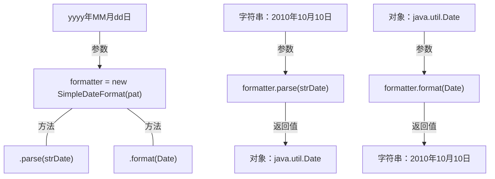
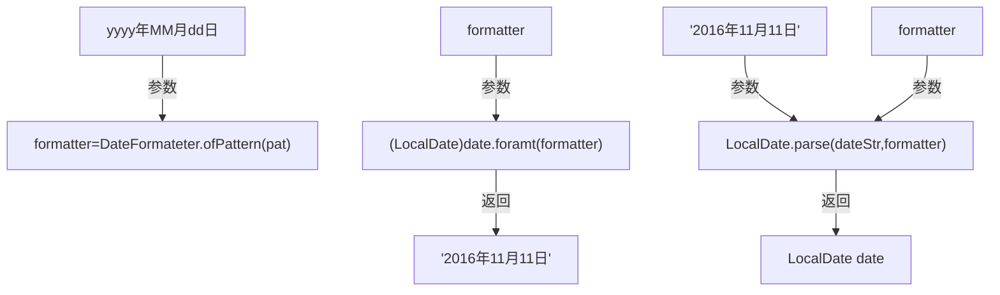

# 时间格式化类

## SimpleDateFormat类

*抽象类，工厂方法。用于java.util.Date和java.sql.Date。线程不安全*



- 字符串格式化为时间对象

    *.parse()方法*

    ```java
        // 从字符串提取出日期
        String strDate = "2008-11-17";
        String pat = "yyyy-MM-dd";
        SimpleDateFormat format2 = new SimpleDateFormat(pat);
        Date d = null;
        try {
            //生成时间对象
            d = format2.parse(strDate);
        } catch (Exception e) {
            e.printStackTrace();
        }
        System.out.println(format.format(d));

        //运行结果：Mon Nov 17 00:00:00 CST 2008
    ```

- 时间对象格式化为字符串

    .format()方法

    ```java
            // 将时间对象格式化为字符串
            Calendar cal = Calendar.getInstance();
            Date now = cal.getTime();
            SimpleDateFormat format = new SimpleDateFormat("yyyy年MM月dd日");
            String strDate = format.format(now);
            System.out.println(strDate);

            //运行结果：2019年06月20日
    ```

---

## DateTimeFormatter类

*java.time.format.DateTimeFormatter。用于java.time类中的时间日期格式化。线程安全*



- 字符串转化为时间对象

    .parse()

    ```java
        // 将字符串转化为时间
        String dateStr = "2016年10月25日";
        DateTimeFormatter formatter = DateTimeFormatter.ofPattern("yyyy年MM月dd日");
        LocalDate date = LocalDate.parse(dateStr, formatter);
        System.out.println(date);

        //结果：2016-10-25
    ```
- 时间对象格式化为字符串

    .format()

    ```java
        // 将日期转化为字符串
        LocalDateTime now = LocalDateTime.now();
        DateTimeFormatter formatter2 = DateTimeFormatter.ofPattern("yyyy年MM月dd日 hh:mm:ss");
        String nowStr = now.format(formatter2);
        System.out.println(nowStr);

        //j结果：2019年06月20日 04:38:41
    ```
